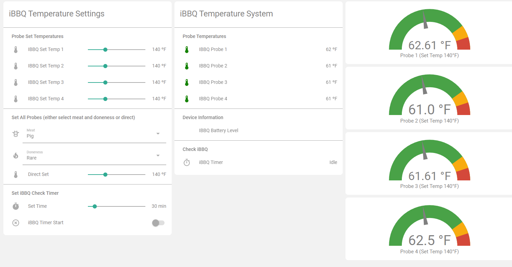
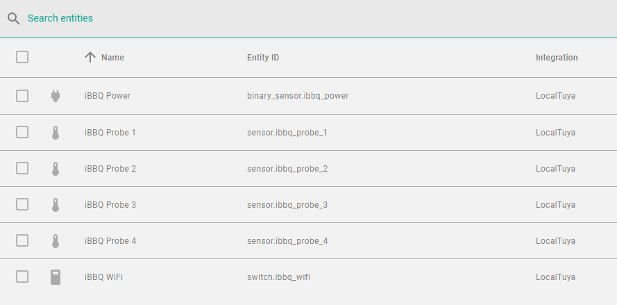

# iBBQ-4T Home Assistant Panel
This is a set of input_number, input_select, input_boolean, automations and Lovelace yaml for the iBBQ-4T Home Assistant Panel

Please note that I mostly use includes to include other yaml files, you may need to put some of these in your own or create them if you wish to use as is. In my setup, it would look like this:

```
automation: !include automations.yaml
binary_sensor: !include binary_sensor.yaml
input_boolean: !include input_boolean.yaml
input_number: !include input_number.yaml
input_select: !include input_select.yaml
timer: !include timers.yaml
template: !include template.yaml

```

For the initial upload, I believe I captured everything.

The final product on my system looks like this:




The left section presents the settings where you can set probes individually or all together and also set up a timer and start it. The middle section presents the current state. The right section is a chart-based representation.

Of course, there are many things one must do first. My implementation uses the LocalTuya integration. There are many instruction sets on how to get this up and running and this is not part of this solution. The minimal requirements one needs are the 4 probe sensors. One may also wish to have the binary_sensor for power should you want conditional cards and the battery level and wifi switch. In my solution, the entities look like this:



The remainder of the files in this repository are the various entities for selecting meat/doneness, and automations that do various things like change all values when something changes as well as sending announcments to cell and/or Alexa. The file "Lovelace_Panel.yaml" is only the tab containing all the cards. There are some custom components used in this so you may need to change it or install these if you do not have them.

The original implementation used vars and that has been removed in recent Home Assistant update. This has been replaced by a template sensor now.

